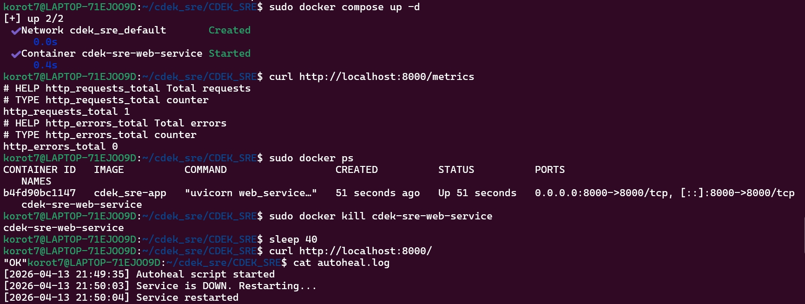

# Базовые вопросы

## 1. Дополнительные метрики

1. **http_request_duration_seconds** (Тип: histogram)
   - Время обработки запросов
   - Позволяет отслеживать перцентили (p50, p95, p99)

2. **http_requests_in_progress** (Тип: gauge)
   - Количество одновременно обрабатываемых запросов
   - Помогает выявить перегрузку сервиса

3. **process_resident_memory_bytes** (Тип: gauge)
   - Использование оперативной памяти
   - Выявляет утечки памяти

4. **process_cpu_seconds_total** (Тип: counter)
   - Время CPU, использованное процессом
   - Помогает определить проблемы с производительностью

## 2. Проверка автовосстановления контейнера

### Команда для имитации падения:
```bash
docker kill <Название контейнера>
```


# SRE-вопросы:

## 4. SLI / SLO

### Расчёт допустимого downtime в месяц:

**Исходные данные:**
- В месяце: 30 дней × 24 часа × 60 минут = **43,200 минут**
- SLO: 99.5% (uptime) → 0.5% (downtime)

**Расчёт:**

Допустимый downtime = 43,200 мин × (100% - 99.5%) / 100%
= 43,200 × 0.005
= 216 минут в месяц

### Вывод:
При SLO 99.5% сервис может быть недоступен **максимум 216 минут в месяц**.

## 5. Постмортем (postmortem)

### Постмортем: Сервис не отвечал 15 минут из-за утечки памяти

### Причина:
Утечка памяти в функции обработки больших JSON-файлов. Объекты не освобождались из памяти после обработки, 
что привело к превышению лимита RAM и падению контейнера.

### Как обнаружили:
Cистема мониторинга (Prometheus) зафиксировала резкий рост метрики memory_usage_bytes и падение http_requests_total. 
Сработал алерт на нарушение SLO по доступности.

### Как исправили:
1. Вручную увеличили лимит памяти контейнера с 512MB до 1GB (временное решение)
2. Перезапустили сервис

### Что сделаем, чтобы не повторилось:
- **Краткосрочно**: Добавим memory limits и alerts на уровне 80% использования
- **Долгосрочно**: Внедрим профилирование памяти в staging-окружении и внедрим нагрузочное тестирование 
в CI-пайплайн для выявления утечек памяти до релиза.
- **Процессы**: Проведём code review всех функций, работающих с большими объёмами данных
- **Мониторинг**: Добавим метрику `memory_usage_by_endpoint` для выявления проблемных эндпоинтов
